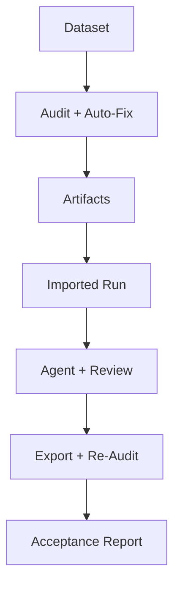

# Architecture

This project is organized around a simple idea:

**compute risk offline, then turn that risk into a structured human acceptance workflow.**

## High-Level Layers

### 1. Offline audit pipeline

`dataset_audit_pipeline/` is responsible for producing facts about the dataset.

It handles:

- static schema checks
- label consistency checks
- model-assisted risk discovery
- static-conflict auto-fix
- audit reports and intermediate artifacts

This layer does not try to make final acceptance decisions. It gathers evidence.

### 2. Local review platform

`dataset_review_platform_backend/` is responsible for turning audit evidence into actions.

It handles:

- attaching dataset directories or existing audit runs
- launching and monitoring audit jobs
- showing Agent acceptance summaries
- presenting high-risk rows for review
- storing human decisions and corrected labels
- exporting cleaned datasets
- generating acceptance reports

This layer is where deterministic audit output and human judgment meet.

## Core Data Flow

## Why The Split Matters

Keeping the offline pipeline and review platform separate has a few benefits:

### Deterministic checks stay deterministic

Static rules, split leakage checks, and consistency checks should remain reproducible. They should not depend on UI state or human timing.

### Human review stays focused

The platform should not make operators dig through raw audit files. It should show:

- what is blocked
- what was auto-fixed
- what still needs attention
- whether the run is ready to export

### Remote execution remains practical

Some datasets or models live on servers. The project supports running the audit remotely while still reviewing the results locally.

## Main Artifacts

Typical artifacts produced by the pipeline include:

- `run_summary.json`
- `static_summary.json`
- `consistency_summary.json`
- `model_risk_summary.json`
- `audit_report.md`
- `llm_analysis_report.md`
- `auto_fix_summary.json`
- `auto_fix_changes.jsonl`
- `auto_fixed_dataset/`

The platform consumes those artifacts and adds:

- run metadata
- task metadata
- review decisions
- acceptance reports
- cleaned dataset exports

## Acceptance Logic

The platform-level Agent is intentionally conservative.

It does not try to replace human review everywhere. Instead, it asks:

- are there blocking issues?
- did auto-fix reduce or clear static risk?
- do unresolved high-risk buckets remain?
- is the run already safe enough to export?

One important rule in the current design is:

> if auto-fix has cleared the remaining risk and only `clean` rows remain, the run should move toward export instead of forcing more manual review by default.

## Extension Points

The architecture leaves room for future expansion:

- richer issue taxonomies
- more model backends
- stronger writeback loops
- dataset version comparison
- team review workflows
- lightweight annotation interfaces

The current system is already usable end-to-end, but it is designed so these additions can be layered in without collapsing the core workflow.
