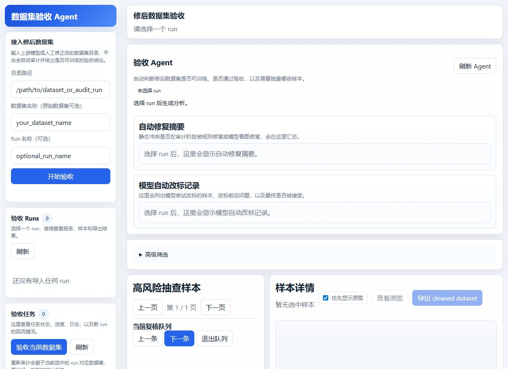
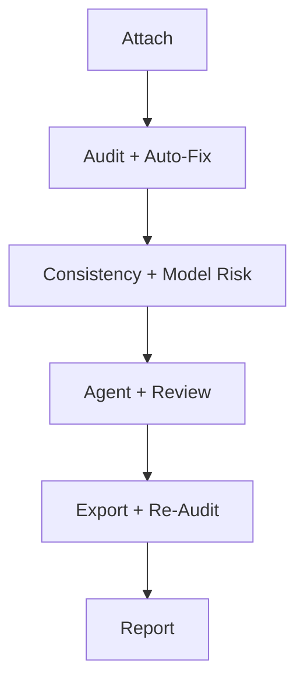
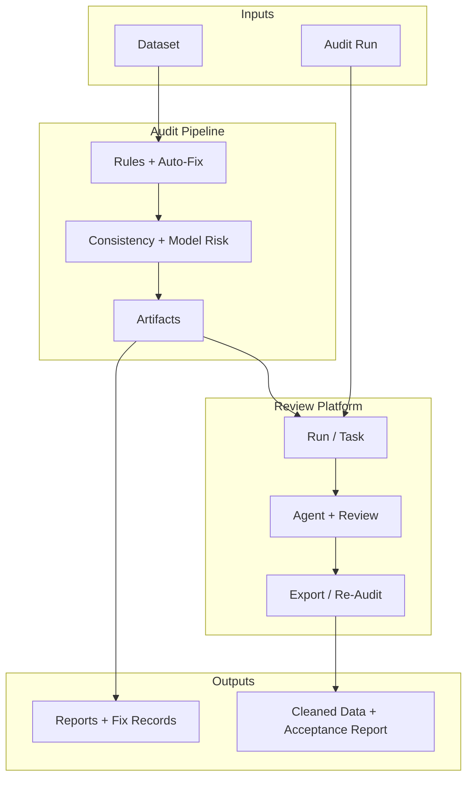

# Dataset Review Agent

Dataset Review Agent is an acceptance and review toolkit for vision and multimodal training datasets.

It helps answer two practical questions before training starts:

1. Can this corrected dataset safely enter training?
2. If not, which layer is still problematic: schema, consistency, model disagreement, or human labeling?

This repository combines an offline audit pipeline with a local review platform, so teams can move from automatic issue discovery to human acceptance in one workflow.



## Who This Is For

Dataset Review Agent is useful for teams that already have labels, but do not yet trust the dataset enough to train on it.

Typical users include:

- vision model teams validating corrected datasets before training
- multimodal teams checking whether model-generated labels are actually usable
- data operations teams cleaning schema conflicts and dataset splits
- researchers who want a reproducible acceptance workflow instead of ad hoc spot checks

## What It Does

- Audit raw or corrected dataset directories
- Detect static label conflicts and schema problems
- Detect cross-sample consistency risks
- Use an OpenAI-compatible multimodal model to surface higher-level risks
- Run an `auto-fix` loop for static conflicts before manual acceptance
- Record which rows were rule-fixed and which rows were model-fixed
- Surface a "ready to export" decision when auto-fix has cleared the remaining risk
- Support human review, label correction, and cleaned dataset export
- Re-audit cleaned datasets and generate acceptance reports

## Main Workflow



## Architecture Overview



The architecture is intentionally split into two layers:

- the **offline pipeline** computes audit facts, risk rankings, and auto-fix artifacts
- the **local review platform** turns those artifacts into an acceptance workflow for humans

That split makes it easier to:

- run audits on servers but review locally
- re-import historical audit runs
- separate deterministic checks from human judgment

## Project Structure

```text
dataset-review-agent/
  dataset_audit_pipeline/          # Offline audit pipeline
  dataset_review_platform_backend/ # Local review platform
  deploy/server/                   # Long-running deployment scripts
  scripts/                         # Packaging helpers
  assets/                          # README images
  README.md
  ROADMAP.md
  CONTRIBUTING.md
```

## Core Components

### `dataset_audit_pipeline/`

The offline pipeline is responsible for:

- schema and static rule checks
- consistency checks across rows
- multimodal model-assisted risk discovery
- risk ranking
- manual review pack generation
- Chinese audit and analysis reports
- static-conflict auto-fix loop

### `dataset_review_platform_backend/`

The local platform turns audit outputs into an interactive acceptance flow:

- attach a raw dataset directory or an existing audit run
- trigger audit jobs
- show Agent-level acceptance summaries
- show auto-fix summaries and model auto-fix records
- inspect high-risk samples
- apply human decisions
- edit labels inline
- export cleaned datasets
- generate acceptance reports

## What The Agent Decides

The platform-level Agent is intentionally conservative. It helps answer:

- are there still blocking issues before training?
- did `auto-fix` actually reduce or clear static conflicts?
- does this run still need human review?
- is the dataset already clean enough to export and re-audit?

When the run only contains `clean` samples after auto-fix and no blocking issues remain, the Agent can move the run into a **ready-to-export** state instead of forcing more manual review.

## Quick Start

### 1. Install dependencies

```bash
pip install -r requirements.txt
```

### 2. Configure environment variables

Copy `.env.example` and fill in your own environment values.

Most users only need:

- `DATASET_AUDIT_API_KEY`
- `DATASET_REVIEW_MODEL_ENDPOINT`
- `DATASET_REVIEW_MODEL_NAME`

### 3. Start the local review platform

PowerShell:

```powershell
.\start_review_platform.ps1
```

Bash:

```bash
bash ./start_review_platform.sh
```

Default URL:

- [http://127.0.0.1:8017/](http://127.0.0.1:8017/)

### 4. Run the audit pipeline directly

```bash
cd dataset_audit_pipeline
python run_audit.py --config config.example.json
```

## Typical Acceptance Flow

1. Attach a corrected dataset
2. Run static audit
3. Let the pipeline attempt static-conflict auto-fix
4. Run consistency checks and model-assisted risk discovery
5. Review the Agent summary, auto-fix summary, and model auto-fix records
6. If issues remain, inspect high-risk samples manually
7. Correct labels where needed
8. Export a cleaned dataset
9. Re-audit the cleaned dataset
10. Decide whether the dataset is ready for training

## Current UI Workflow

Inside the local platform, a typical run now looks like this:

1. Attach a corrected dataset or existing audit run
2. Wait for audit + auto-fix to finish
3. Read the Agent headline
4. Check the **auto-fix summary**
5. Inspect the **model auto-fix records**
6. If needed, manually fix labels on remaining high-risk rows
7. Export `cleaned_dataset`
8. Generate a Chinese acceptance report

If the Agent reports that the run is already ready to export, the UI highlights:

- `Export cleaned dataset`
- `Generate acceptance report`

so the operator does not have to continue reviewing `clean` rows by default.

## Tests

```bash
python dataset_review_platform_backend/tests/test_api_smoke.py
python dataset_audit_pipeline/tests/test_resume_retry_validation.py
python dataset_audit_pipeline/tests/test_auto_fix_loop.py
```

## Privacy and Open-Source Notes

This public repository is intentionally sanitized:

- no private audit runs
- no internal database files
- no task logs
- no production secrets
- no internal hostnames or dataset paths

Only source code, demo assets, tests, and reusable deployment scripts are included.

Default hostnames, usernames, model names, and sample paths are placeholders for local setup. Replace them with your own environment values through `.env` or shell variables instead of editing secrets into source files.

## Related Docs

- [Roadmap](ROADMAP.md)
- [Contributing Guide](CONTRIBUTING.md)
- [Architecture](ARCHITECTURE.md)
- [Audit Pipeline README](dataset_audit_pipeline/README.md)
- [Platform README](dataset_review_platform_backend/README.md)

## License

MIT. See [LICENSE](LICENSE).
